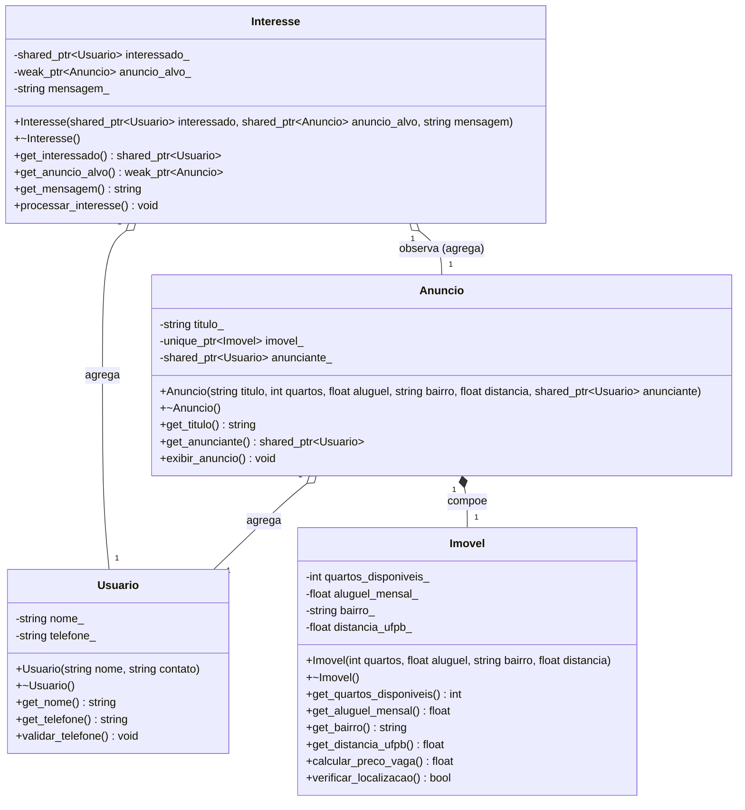

# Sistema UFLX
Projeto da disciplina Programação Orientada a Objetos que busco criar um sistema de comércio de imóveis voltado aos estudantes da UFPB.

Percebo que a forma de contato que os estudantes de superior têm para procurar/encontrar/oferecer vagas em imóveis (ou imóveis por completo) se limitam somente a grupos de conversa em aplicativos de rede social. Por conta disso, planejo criar esse sistema para melhorar essa situação e ajudar estudantes a encontrar/oferecer imóveis para moradia.

## Descrição do Domínio
O UFLX é um sistema de comércio de imóveis voltado para estudantes universitários. A plataforma permite que proprietários anunciem vagas ou imóveis completos e que estudantes demonstrem interesse nessas ofertas, facilitando o contato direto entre as partes.

## Diagrama UML

#### ---
*Artur Rodrigues Nunes de Almeida - 20250018637 - Aluno de Ciência de Dados e Inteligência Artificial - Centro de Informática (CI) / UFPB*